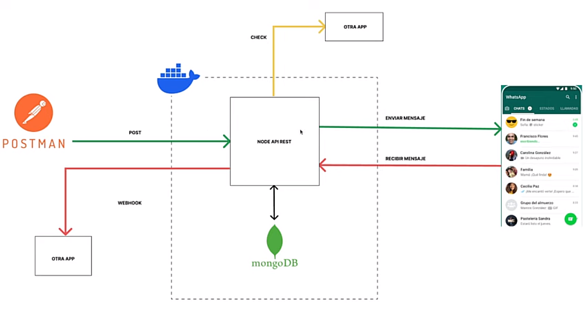

# Api Rest Whatsapp con mongDB

- Con nuestra Node Api Rest vamos a guardar toda nuestra información de mensajes en nuestra base de datos de mongoDB.
- Con postman creamos la petición POST donde el Api Rest va a procesar y enviar el mensaje a la persona que el post le esté enviando.
- Cuando recibe un mensaje la comunicación va a ser mediante un evento de la librería y lo voy a enviar a un URL de otro aplicativo que va a estar esperando que llegue el mensaje.

## En resumen:
Creamos una API rest de la librería de Whatsapp el cual te permite mandar mensajes y tiene un "webhook" para recibir el mensaje en otra aplicación la cual tendrá una URL externa.

## Steps
- npm init -y
    - "scripts" => "dev": "node index.js"

- npm i -g eslint (instalar ESlint)
    - npx eslint --init
        - To check syntas, find problems, and enforce code style
        - JavaScript modules (import/export)
        - None of these
        - No TypeScript
        - Node
        - Use a popular style guide
        - Standard: https://github.com/standard/standard
        - JavaScript
        - Yes
        - npm

- install https://wwebjs.dev/guide/
    - npm i whatsapp-web.js qrcode-terminal

- src/ config / wsp / initWSP.js
    - Paste whatsapp-web.js config "First Steps & QR Code generation & Listening for messages"
    - Add Authentication {authStrategy: new NoAuth()} and import 'NoAuth'
    - Add listening "autentication" & "autientication failed"
    - Add listening loading screen
    - Envolve all into async function initializeWSP & add 'await' to client.initialize();
    - module.exports = {initializeWSP}
    - Create clientWSP var and replace into all "client"
    - import function in index.js and run
    - send msg !ping and it returns pong
    - change NoAuth() for LocalAuth() and npm run dev, it creates ".wwebjs_auth" and relogin wsp

- Create api rest using express & mongoose to connect to mongoDB
    - npm i express mongoose
    - in initWSP we create async function sendMsg with params number & msg and export function module.exports

- /src/config/wsp/apirest-server.js and create a post with function and export app.

- /src/controller/envio.controller.js and create arrow function (req,res), export it and import in api-server

- Create async invoked function in index.js and paste inicializeWSP with await. Then import app (server) and do a listen
    - envolved in a try/catch
    - run project 
    - make a request 'POST' in PostMan (abrir postman agent) at localhost:3000/envio and paste in Body (raw) the "numero": & "message":
    - If error npm install whatsapp-web.js@latest to update the library

- Una vez enviado el mensaje ahora debemos recibir el mensaje y hacer un webhook que es una comunicación que enviamos externa, es decir a una url donde voy a enviar
    - /src/config/weebhook.js create arrow async function sendMsgReceived with params numero & mensaje
    - create URL and POST request, then fetch url and request, export the function
    - add in initWSP the clientWSP.on(msg)

- Crear un proyecto para escuchar el mensaje que estamos recibiendo a través del webhook
    - npm init -y
    - npm i express
    - crear una ruta POST y ponerle el enlace que pusimos en el webhook
    - ejecutar ambos servidores y al mandar un mensaje al "bot" (nuestro qr) debemos recibir en la consola de la api una respuesta exitosa y en nuestra app el .json del numero y msg.
 